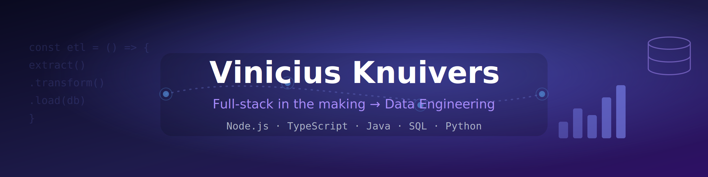

<!-- Upload header_github_en.png to your repo (e.g. an assets/ folder) and the path below will work -->

  

  <a href="./README.md">🇧🇷 Português</a> · <b>🇺🇸 English</b>

  
  

---

### 🚀 About me

- 🎓 Computer Science undergraduate (8th semester) — Faculdade Municipal Prof. Franco Montoro, graduating **Dec 2026**
- 💻 Building a foundation as a **full-stack developer** and **transitioning into Data Engineering**
- 🧠 **Thesis:** benchmarking LLM accuracy in generating **SQL from natural language in Brazilian Portuguese**
- 🌱 Current focus: deepening **Python** and getting started with **data pipelines** (Data Engineering Zoomcamp)
- 💼 First IT experience as an intern FGV - Projects (QA & documentation) on a municipal public-sector platform
- 💬 Ask me about **backend, data, Java, SQL and LLMs**

---

### 🛠️ Tech stack

**Languages**

**Frontend**

**Backend**

**Data & Infra**

**Tools**

<!-- I also have some C++ basics. To show it, just uncomment:

-->

---

  <i>🚧 Always building — from full-stack to data.</i>

