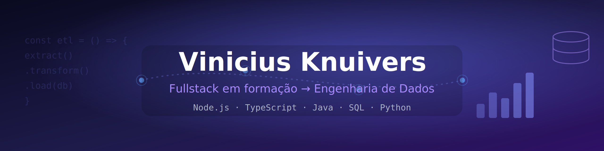

<!-- Suba o arquivo header_github.png para o seu repo (ex.: pasta assets/) e o caminho abaixo funciona -->

  

  <b>🇧🇷 Português</b> · <a href="https://github.com/ViniKnuivers/ViniKnuivers/blob/main/README.en.md">🇺🇸 English</a>

  

  
  

---

### 🚀 Sobre mim

- 🎓 Graduando em **Ciência da Computação** (8º semestre) — Faculdade Municipal Prof. Franco Montoro, formatura em **dez/2026**
- 💻 Construindo base como **desenvolvedor fullstack** e em **transição para Engenharia de Dados**
- 🧠 **TCC:** benchmark de precisão de LLMs na geração de **SQL a partir de linguagem natural em português**
- 🌱 Foco atual: aprofundando **Python** e iniciando os estudos em **pipelines de dados** (Data Engineering Zoomcamp)
- 💼 Primeira experiência em TI como estagiário na FGV - Projetos (Fundação Getúlio Vargas) (QA e documentação) em plataforma pública municipal
- 💬 Fala comigo sobre **backend, dados, Java, SQL e LLMs**

---

### 🛠️ Tecnologias

**Linguagens**

**Frontend**

**Backend**

**Dados & Infra**

**Ferramentas**

<!-- Tem noção de C++ também. Se quiser exibir, é só descomentar:

-->

---

  <i>🚧 Em construção constante — do fullstack aos dados.</i>

